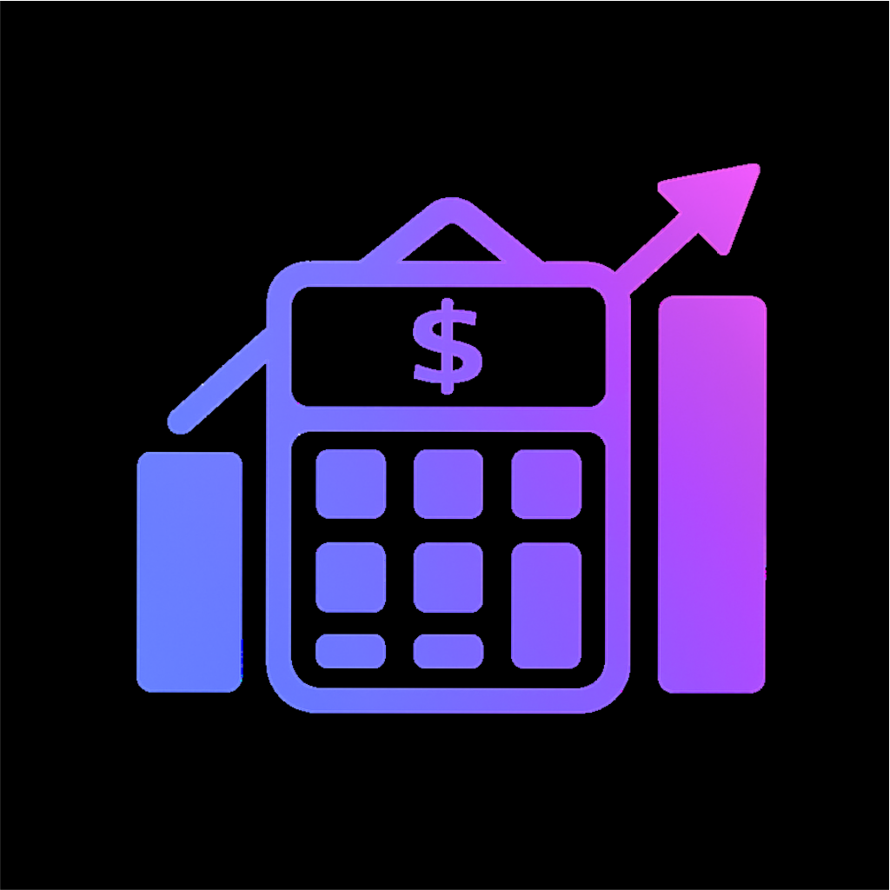

<p align="center">
  
</p>

<h1 align="center">Crypto Trade Analyzer</h1>

<p align="center">
  Identify the most cost-efficient exchange by comparing spend and receive amounts from<br>
  simulated order execution, using real-time order book data and fees.
</p>

<p align="center">
  <a href="https://github.com/binance/crypto-trade-analyzer/actions"></a>
  
  <a href="https://github.com/binance/crypto-trade-analyzer/issues"></a>
  <a href="https://github.com/binance/crypto-trade-analyzer/stargazers"></a>
  <a href="https://github.com/binance/crypto-trade-analyzer/network/members"></a>
</p>

<p align="center">
  <a href="https://www.typescriptlang.org/"></a>
  <a href="https://reactjs.org/"></a>
  <a href="https://vitejs.dev/"></a>
  <a href="https://tailwindcss.com/"></a>
  <a href="https://prettier.io/"></a>
</p>

<p align="center">
  <strong>Live App:</strong> <a href="https://binance.github.io/crypto-trade-analyzer">binance.github.io/crypto-trade-analyzer</a>
</p>

---

> **📋 Important:** Please review our [Product Terms](./PRODUCT_TERMS.md) and [License](./LICENSE) before using this tool.  
> **📝 Updates:** See the [Changelog](./CHANGELOG.md) for recent changes and version history.

## Table of Contents

- [Features](#-features)
  - [Supported Exchanges](#supported-exchanges)
- [Installation](#-installation)
- [Tech Stack](#-tech-stack)
- [Privacy & Analytics](#-privacy--analytics)
- [Data Sources & Attribution](#-data-sources--attribution)
- [Project Structure](#-project-structure)
- [Contributing](#-contributing)
- [API Rate Limits](#-api-rate-limits)
- [Disclaimer](#-disclaimer)
- [License](#-license)

## 🚀 Features

- **Multi-Exchange Support**: Compare trade results across Binance, Bybit, Coinbase, and OKX.
- **Configurable Order Inputs**: **Spot Market** Orders, with order size configurable in either the base or quote asset, and symbols selectable from any available on the chosen exchange.
- **Live OrderBooks side-by-side**: Live streaming of order books from multiple exchanges.
- **Trade Cost (Spend) Simulation**: Simulate order execution to calculate the total trade cost, taking into account slippage and trading fees.
- **Trade Receive Simulation**: Simulate order execution to calculate the net amount received from a trade.
- **Realistic Fee Modeling**: Take into account taker fees, user tiers, and trading pair discounts.
- **Tick Size Normalization**: This tool queries exchanges' APIs for the trading pair's tick size (minimum price increment), then normalizes all order books to the largest tick size for fair and consistent price comparisons across exchanges.
- **Live Best Exchange Badge**: Automatically highlight the best exchange for your specific trade.
- **Smart Startup Selection of Order Inputs**: On first tool load, to better reflect real-life trading behavior:
  - Trading Pair: Random selection from a predefined list of popular cross-exchange pairs.
  - Order size: Random selection within a realistic, market-based range.
  - Order side: Probabilistic selection of the BUY/SELL side based on market sentiment derived from short-term candlesticks.

### Supported Exchanges

| Exchange | Spot Trading | Fee Tiers | Token Discounts |
| -------- | ------------ | --------- | --------------- |
| Binance  | ✅           | ✅        | ✅ (BNB)        |
| Bybit    | ✅           | ✅        | ❌              |
| Coinbase | ✅           | ✅        | ❌              |
| OKX      | ✅           | ✅        | ❌              |

## 🔧 Installation

### Prerequisites

- Node.js `18.x` or higher
- `npm`, `pnpm`, or `yarn`

### Setup

```bash
# Clone the repository
git clone https://github.com/binance/crypto-trade-analyzer.git

# Navigate to project directory
cd crypto-trade-analyzer

# Install dependencies
npm install

# Start development server
npm run dev
```

### Development

```bash
# Start development server with hot reload
npm run dev

# Build for production
npm run build

# Preview production build locally
npm run preview

# Run ESLint
npm run lint

# Format code with Prettier
npm run format
```

## 🛠 Tech Stack

- **Frontend**: React and TypeScript (Vite)
- **Styling**: Tailwind CSS
- **Code Quality**: ESLint, Prettier, Husky, lint-staged
- **WebSocket**: Native WebSocket connections for real-time data
- **State Management**: React hooks

### Cache Entry format

Cached entries share a common shape:

```jsonc
{
  "ts": 1731345678901, // timestamp (ms)
  "data": 123.45, // cached value
  "meta": { "source": "coingecko" }, // optional metadata
}
```

- `ts` — timestamp (ms) used for freshness checks
- `data` — the cached value
- `meta` — optional metadata (e.g., `source`, `etag`, `version`)

> **Notes**
>
> - If `localStorage` is unavailable (private mode/restricted contexts), the app falls back gracefully and refetches as needed.
> - Stablecoins are returned 1:1 to USD and typically aren’t cached.

## 🔒 Privacy & Analytics

### What we don’t do

- No ads, remarketing, or personalization (explicitly disabled).
- No fingerprinting or cross-site identifiers from our code.
- No analytics tracking if **Do Not Track (DNT)** is enabled.
- No emails, names, wallet addresses, exchange account IDs, order IDs, or other sensitive identifiers are persisted.
- No custom cookies for analytics.

### Analytics & Storage

This app uses Google Analytics 4 (GA4) to understand usage patterns and improve UX.

- The analytics runs client-side; events go directly from your browser to GA4.
- The app’s own caching and preferences live in your browser’s storage.

### What we track (events & properties)

| Event name               | When it fires                       | Properties sent                                                                                                                                |
| ------------------------ | ----------------------------------- | ---------------------------------------------------------------------------------------------------------------------------------------------- |
| `page_view`              | Page load / route change            | `page_location`, `page_path`, `page_title`                                                                                                     |
| `trading_pair_selected`  | You pick a trading pair             | `trading_pair`, `base`, `quote`, `ts`                                                                                                          |
| `exchanges_selected`     | You change selected exchanges       | `exchanges`, `ts`                                                                                                                              |
| `calc_performed`         | A comparison run completes          | `trading_pair`, `side`, `quantity`, `selected_exchanges`, `best_exchange`, `best_exchange_account_prefs`, `best_exchange_cost_breakdown`, `ts` |
| `calc_latency`           | Cost-calc latency is measured       | `exchange`, `ms`, `bucket`                                                                                                                     |
| `orderbook_push_latency` | Order-book push latency is measured | `exchange`, `ms`, `bucket`                                                                                                                     |
| `exchange_status`        | An exchange connector goes up/down  | `exchange`, `status`, `reason`, `down_duration_ms`, `ts`                                                                                       |

### What we cache (local storage)

The app uses the browser’s storage to reduce API calls and speed up startup.

| Purpose                                | Key pattern                                                                                       | Value shape                                                        |                       TTL |
| -------------------------------------- | ------------------------------------------------------------------------------------------------- | ------------------------------------------------------------------ | ------------------------: |
| **USD price cache**                    | `usdconv:v1:<ASSET>` (e.g. `usdconv:v1:BTC`)                                                      | `{"ts": <ms>, "data": <number>, "meta": {"source": "<api>"}}`      |    **60s** (configurable) |
| **Pair list (all)**                    | `pairdir:v1:pairs:<ex1,ex2,...>`                                                                  | `{"ts": <ms>, "data": Array<Pair>}`                                | **30 min** (configurable) |
| **Pair list with supported exchanges** | `pairdir:v1:pairsWithEx:<ex1,ex2,...>`                                                            | `{"ts": <ms>, "data": Array<PairWithExchanges>}`                   | **30 min** (configurable) |
| **Market signals cache**               | `marketsignals:v1:candles:global:hours:<HOURS>` (e.g. `marketsignals:v1:candles:global:hours:24`) | `{"ts": <ms>, "data": [{<hour1 candle data>}, ...]}`               |   **1 hr** (configurable) |
| **Per-exchange user settings**         | `ACCOUNT_SETTINGS_STORAGE_KEY`                                                                    | `Record<ExchangeId, { userTier: string; tokenDiscount: boolean }>` |             **No expiry** |
| **Google Analytics consent**           | `GA4_ANALYTICS_CONSENT_KEY`                                                                       | `granted \| denied`                                                |             **No expiry** |

### For developers

- Consent & events implementation: `src/utils/analytics.ts`.
- To ship without analytics, don’t load GA and/or pre-set:

  ```js
  localStorage.setItem('GA4_ANALYTICS_CONSENT_KEY', 'denied');
  ```

## 🌐 Data Sources & Attribution

The tool uses a few public APIs to stay lightweight and up-to-date:

- **Pairs per exchange:**
  - **CoinPaprika** is used to retrieve trading pairs for most exchanges.
    These results are normalized to `BASE/QUOTE` and cached in `localStorage`.
  - **Coinbase special case:** we query **Coinbase Exchange’s own REST API** (`/products`) instead of **CoinPaprika**.
    CoinPaprika’s data source is still based on the old “Coinbase Pro”, which lists pairs not tradable on `api.exchange.coinbase.com`.  
    Using Coinbase’s official endpoint ensures the list of pairs always matches the real, unauthenticated market data API we use elsewhere.

- **USD price equivalents:**
  We fetch coin to USD conversion rates from **CoinGecko**.
  Price results are cached for **60s** to reduce API usage and improve responsiveness.

- **Market Signals:**  
  To generate a realistic default order side (BUY or SELL), the app uses **Coindesk’s Market Data API**. It fetches recent hourly open/close prices and computes short-term sentiment by analyzing price movements. The model blends long-term and recent interval ratios to derive probabilistic BUY/SELL weights. These results are cached briefly and used only for startup defaults — they never override explicit user choices.

## 📁 Project Structure

```bash
├─ src/
│  ├─ app/
│  │  ├─ components/          # Reusable UI components
│  │  ├─ hooks/               # React hooks (e.g., useExchangeEngine)
│  │  ├─ icons/               # Icon components/assets
│  │  ├─ pages/               # Application pages
│  │  ├─ providers/           # Context providers
│  │  ├─ App.tsx              # App shell
│  │  └─ types.ts             # App-level types
│  ├─ core/                   # Interfaces, order-book & fee config
│  ├─ exchanges/              # Exchange adapters (binance, bybit, coinbase, okx, …)
│  ├─ utils/                  # Bucketize, formatting, helpers
```

## 🤝 Contributing

We welcome contributions! Here's how to get started:

### Development Setup

1. Fork the repository and create a feature branch
2. Make your changes
3. Run `npm run format` and `npm run lint`
4. Open a pull request

### Adding a New Exchange

To add support for a new exchange, implement the following interface:

- `watchLivePair()` / `unwatchLivePair()` — manage WS and local book with resync
- `onLiveBook()` — push book updates to the UI
- `getPairSymbol()` — standardized trading pair mapping
- `getTickSize()` — REST once; cache per (exchange, trading pair)
- `calculateCost()` — call the shared calculator (bucket first if `priceBucket` is provided)
- `disconnect()` — clean shutdown

### Code Standards

- Follow TypeScript best practices
- Use meaningful commit messages
- Ensure all CI checks pass

## 📊 API Rate Limits

The application respects exchange API rate limits through:

- WebSocket connections for real-time data (preferred)
- Safe reconnection with jitter/backoff
- Request throttling for REST API calls
- Local caching to minimize API requests

## ⚠ Disclaimer

This tool is designed for educational and research purposes. Trading cryptocurrencies involves significant risk, and past performance does not guarantee future results. Always verify costs independently before making trades. Exchange fees and policies may change without notice. You may view the full disclaimer in the [Product Terms](./PRODUCT_TERMS.md).

## 📄 License

This project is licensed under the **Binance Source-Available and Non-Commercial License v1.0**.  
You may view the full text in the [LICENSE](./LICENSE) file.
